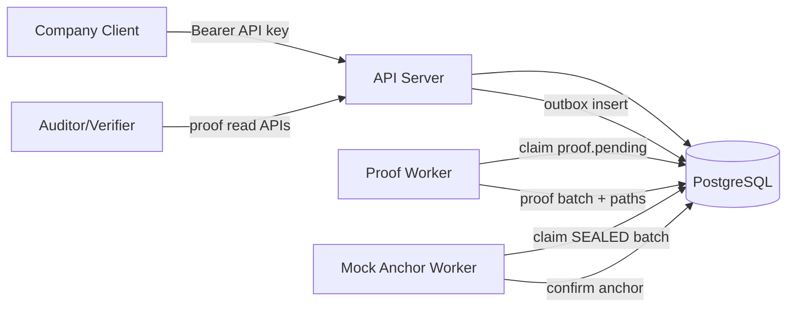
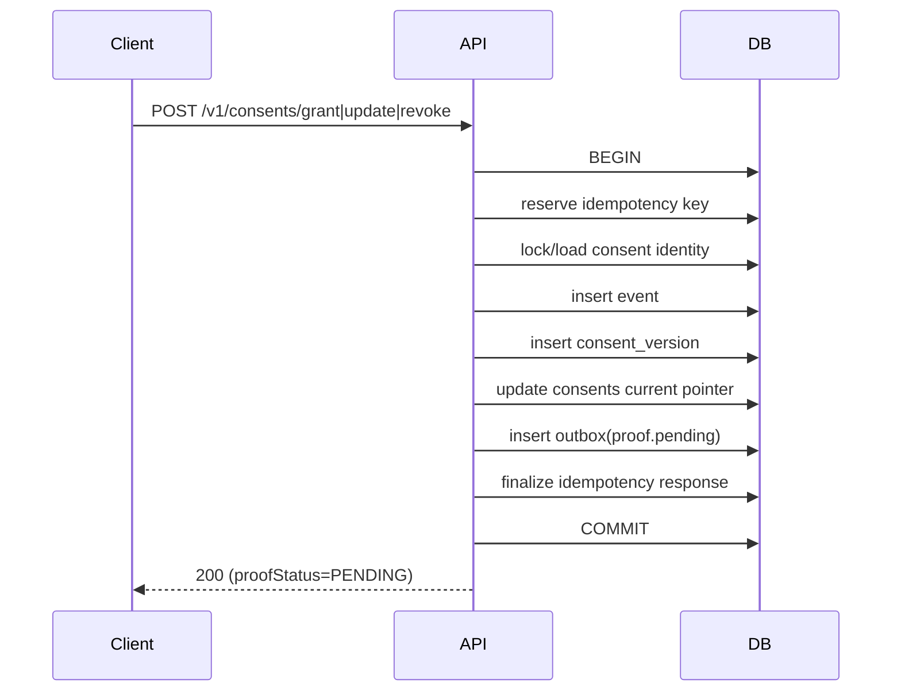
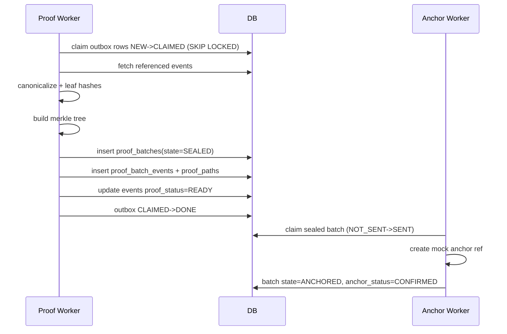
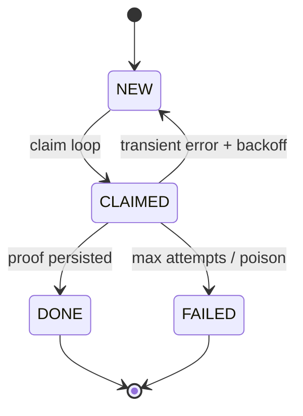
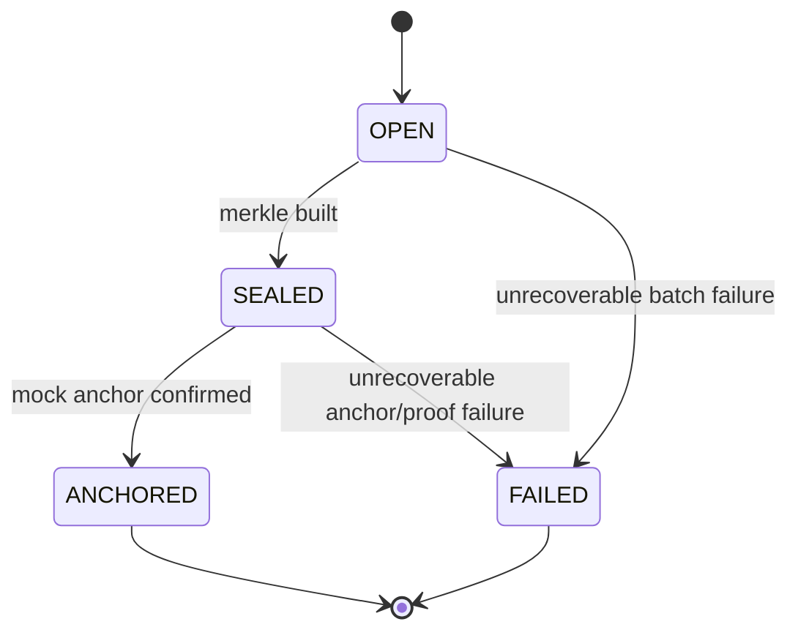
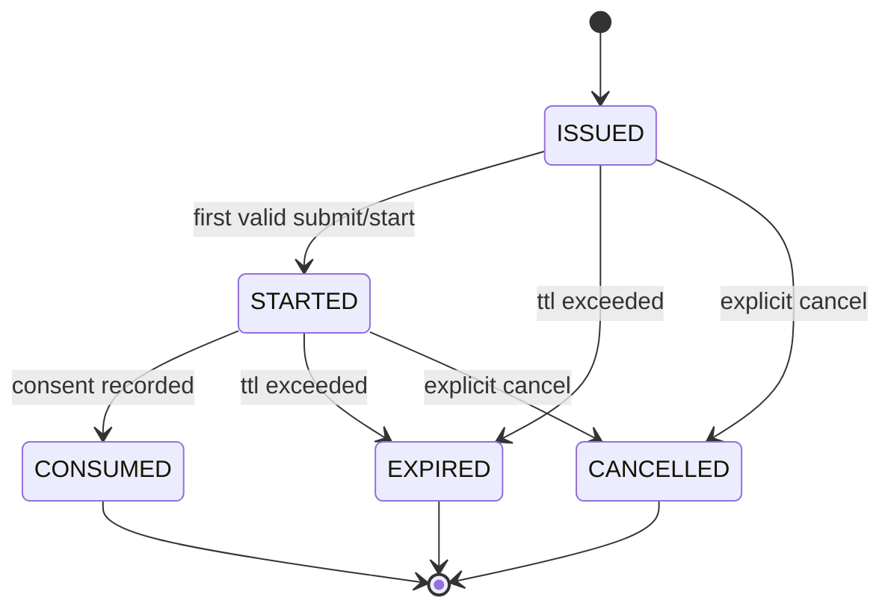
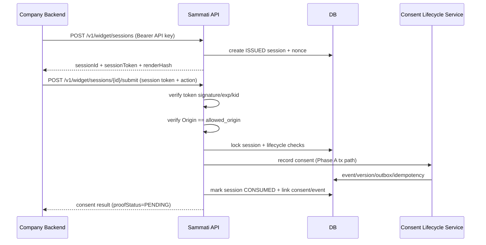

# Architecture diagrams

Mermaid sources for README and design reviews. Render in GitHub, VS Code, or any Mermaid-capable viewer.

---

## 1 — High-level components

## 2 — Phase A: write transaction (sequence)

## 3 — Phase B: proof + mock anchor (sequence)

## 4 — Outbox: retry and terminal states

## 5 — `proof_batches` state machine

---

## 6 — Phase C.2 widget session lifecycle

## 7 — Phase C.2 submit sequence (backend-only)

---

## See also

- [Architecture overview](architecture-overview.md)
- [Phase A API contracts](phase-a-api-contracts.md) · [Phase B API contracts](phase-b-api-contracts.md)

