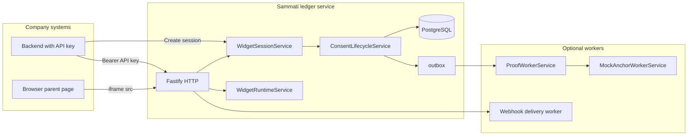
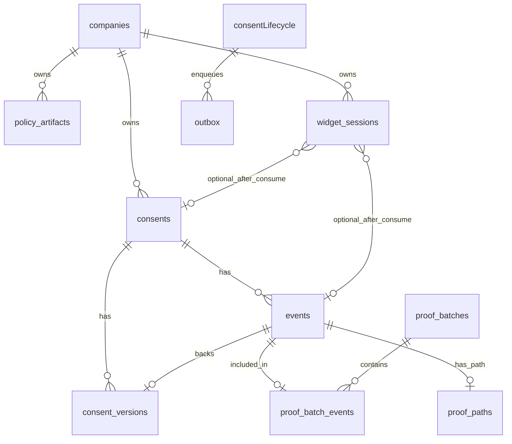

# Internal architecture: ledger, widget runtime, and company integration (Phase P0)

**Status:** living document — P0 handover and hardening baseline.  
**Scope:** this repository (`sammati-ledger`) only. There is **no separate CMS application** in this tree; company sites integrate via **HTTP APIs** and optionally **`@sammati/widget-sdk`**.  
**Non-goals for this document:** no API changes, no refactors — description of **current** behavior only.

**Official handbooks (export / GitHub):** [Platform & API](./HANDBOOK-PLATFORM-ARCHITECTURE-AND-API.md) · [Company onboarding](./HANDBOOK-COMPANY-ONBOARDING.md) · [DB schema & migrations](./HANDBOOK-DB-SCHEMA-AND-MIGRATIONS.md) · [Blockchain integration](./HANDBOOK-BLOCKCHAIN-INTEGRATION.md) · [Docs index](./README.md)

---

## 1. High-level system map

---

## 2. Policy lifecycle

**Storage:** `policy_artifacts` (see §6).  
**States:** `DRAFT` → `PUBLISHED` (→ `DEPRECATED` when used).

**HTTP (all require `Authorization: Bearer <API_KEY>` and company context):**

| Step | Method | Path | Notes |
|------|--------|------|--------|
| Create draft | `POST` | `/v1/policies` | Requires `Idempotency-Key`. Body validated against policy schema (locales, required section ids, etc.). Computes `policy_content_hash`. |
| Publish | `POST` | `/v1/policies/:policyRef/versions/:version/publish` | Requires `Idempotency-Key`. Transitions draft to published; sets `published_at`. |
| Read version | `GET` | `/v1/policies/:policyRef/versions/:version` | Optional `?locale=`. Returns locale content and **render hash** for that locale (for tooling; widget session stores its own `render_hash` at issuance). |
| List versions | `GET` | `/v1/policies/:policyRef/versions` | Paginated. |

**Immutability:** After `PUBLISHED` / `DEPRECATED`, a DB trigger blocks mutation of core content fields (only controlled state/timestamp updates allowed). See migration `004_policy_artifacts.cjs`.

**Binding to widget:** On widget session create, the server loads the **published** row for `(company_id, policy_ref, policy_version)`, validates requested `locale`, then computes **`render_hash`** via `computeRenderHash({ policyContentHash, locale, requiredLegalVersion, uiSchemaVersion })` and persists it on the session. The session **JWS** includes that `render_hash` so the browser cannot swap locale/policy binding without invalidating the token.

**Code references:** `src/services/policy/policyService.ts`, `src/domain/policy/*`, `src/api/http/routes/policies.ts`.

---

## 3. Widget session lifecycle

**Storage:** `widget_sessions` (see §6).  
**States:** `ISSUED` → `STARTED` (on first successful submit path lock) → `CONSUMED` | `EXPIRED` | `CANCELLED`.

| State | Meaning |
|-------|--------|
| `ISSUED` | Session row created; token issued; not yet used for a successful consent write via this session. |
| `STARTED` | First successful processing of submit entered transactional path (status advanced from `ISSUED`). |
| `CONSUMED` | Consent recorded via `ConsentLifecycleService`; session linked to `consent_id` / `events.id` / version metadata. |
| `EXPIRED` | Past `expires_at` or explicitly expired; bootstrap may still be allowed with `allowExpired` on token decode for UX, but submit must fail. |
| `CANCELLED` | Terminal; no submit. |

**Create (company backend):**

- `POST /v1/widget/sessions` — **API key required**, **`Idempotency-Key` required**.
- Body (JSON): `external_user_id`, `purpose_code`, `policy_ref`, `policy_version`, `locale`, `allowed_origin` (must be a valid URL string), optional `environment`, `ttl_seconds` (max 3600, default 600).
- Response (JSON, camelCase keys from service): `sessionId`, `expiresAt`, `render` (`renderHash`, `uiSchemaVersion`), `token` (`sessionToken`).

**Read:**

- `GET /v1/widget/sessions/:sessionId` — API key required; returns status, expiry, optional consent summary fields.

**Cancel / expire (service-level, not always exposed as public routes in this doc’s scope):** `WidgetSessionService.cancelSession` / `expireSession` exist for tests and internal use.

**Webhooks:** After create → `widget.session.created`; after successful submit consumption → `widget.session.consumed` (see `webhookTypes.ts`).

**Code references:** `src/services/widget/widgetSessionService.ts`, `src/api/http/routes/widgetSessions.ts`, `src/persistence/repositories/widgetSessionRepository.ts`.

---

## 4. Hosted widget flow

**Purpose:** Serve a minimal HTML page that runs entirely on the **ledger origin** so it can call bootstrap/submit **same-origin** while being embedded in a **company origin** iframe.

**Entry:** `GET /widget/hosted?session_token=<JWS>`

**Route config:** `skipApiKeyAuth: true`, **`helmet: false`** for this route.

**Steps:**

1. Query param `session_token` validated (min length); token **verified** with `verifyWidgetSessionToken(..., { allowExpired: true })` to read claims **before** returning HTML.
2. Response headers include a strict **`Content-Security-Policy`** (see §8) including **`frame-ancestors <allowed_origin>`** from token claims — this is the primary **embed allowlist** (not Helmet’s default `X-Frame-Options` / CSP frame-ancestors for `'self'`).
3. Body: `text/html` with inline CSS + **inline script** that drives bootstrap + submit (implementation in `src/api/http/routes/widgetRuntime.ts`).

**Code references:** `registerWidgetRuntimeRoutes` in `src/api/http/routes/widgetRuntime.ts`.

---

## 5. Runtime bootstrap flow

**Purpose:** Return safe, server-rendered policy JSON + session metadata for the iframe to paint UI without trusting the parent page for policy text.

**Entry:** `POST /v1/widget/runtime/bootstrap`  
**Auth:** None (API key skipped). **`helmet: false`**.

**Request body (JSON):**

- `session_token` (string, required)
- `parent_origin` (string URL, optional) — if present, **must equal** `allowed_origin` from token claims (defense against confused-deputy style misuse).

**Server (`WidgetRuntimeService.bootstrap`):**

1. Parse/validate body (`WidgetRuntimeBootstrapSchema`).
2. Verify session token with **`allowExpired: true`** (user can receive “expired” UX in iframe).
3. Load session row **for update**; verify company, nonce, `render_hash` match token.
4. If time-expired and still `ISSUED`/`STARTED`, transition to `EXPIRED` inside transaction.
5. Load **published** `policy_artifacts` row; recompute `render_hash` and compare to session (detect drift/tamper).
6. Build response: `version: "1.0"`, `session` (ids, status, `allowed_origin`, `locale`, `purpose_code`, `render_hash`, optional `state_reason`), `policy` (ref, version, title, legal version, UI schema version, **ordered** sections).

**Response:** Validated against `WidgetRuntimeBootstrapResponseSchema` (`src/services/widget/widgetRuntimeContract.ts`).

**Errors (HTTP):** Mapped in route from message substrings (e.g. gone for expired, conflict for consumed/cancelled) — integrators should not rely on message text alone for logic.

---

## 6. Consent submit flow (from widget)

**Entry:** `POST /v1/widget/sessions/:sessionId/submit`  
**Auth:** None (API key skipped). **`helmet: false`**.

**Request:**

- Path: UUID `sessionId` must match token `jti`.
- Headers: see §8 (**`x-sammati-embed-origin`** vs `Origin`).
- Body (JSON): `session_token`, `action` (`GRANT` | `UPDATE` | `REVOKE`), `occurred_at` (ISO datetime).

**Server (`WidgetSessionService.submitSession`):**

1. Parse body; verify token with **`allowExpired: false`** (expired tokens cannot submit).
2. Require **origin header** value **exactly equals** `claims.allowed_origin` (see §8).
3. Transaction: lock session; checks nonce, company, status, expiry; transition `ISSUED` → `STARTED` if needed.
4. Call `ConsentLifecycleService.recordConsent` with:
   - `idempotencyKey`: **`widget-submit-<sessionId>`** (one consent write per session id design).
   - `policyRef`: **`${policy_ref}@v${policy_version}`** string form used on consent timeline.
5. Mark session `CONSUMED` with consent/event pointers; enqueue `widget.session.consumed` webhook payload.

**Response:** Same shape as consent record result: `consentId`, `eventId`, `versionNo`, `currentStatus`, `proofStatus: "PENDING"`.

**Side effects:** Consent row + `events` row + `consent_versions` + idempotency finalize + **`outbox`** row `topic: "proof.pending"` (see §10).

---

## 7. Database table relationships (conceptual ER)

Core consent ledger (migration `001_init_ledger.cjs`):

- **`companies`** — tenant.
- **`consents`** — one row per `(company_id, external_user_id, purpose_code)` timeline.
- **`events`** — append-only consent events; `proof_status`, optional `proof_batch_id`.
- **`consent_versions`** — links each version to exactly one `events.id`.
- **`idempotency_keys`** — per-company idempotency for consent writes (and replays).
- **`outbox`** — async work queue (`topic`, `aggregate_type`, `aggregate_id`, retry fields).

Policy (migration `004_policy_artifacts.cjs`):

- **`policy_artifacts`** — `(company_id, policy_ref, version)` unique; `locales` JSONB; `policy_content_hash`; `state`.

Widget (migration `005_widget_sessions.cjs`):

- **`widget_sessions`** — references `companies`, optional `consents` / `events` after consume; unique `(company_id, nonce)`.

Proof pipeline (migration `003_proof_pipeline.cjs`):

- **`proof_batches`** — Merkle batch metadata; `anchor_mode` default `MOCK`, anchor status enum.
- **`proof_batch_events`** — maps `events` → batch + leaf index/hash.
- **`proof_paths`** — Merkle path material per `event_id`.
- **`events.proof_batch_id`** FK added to link event to batch when ready.

API keys (migration `002_company_api_keys.cjs` — not fully expanded here): company API keys stored hashed for `authApiKeyPlugin`.

Webhooks (migration `006_webhooks.cjs`): endpoints, deliveries, etc. (see webhook docs).

---

## 8. Security and origin handling

### 8.1 Company API traffic

- **`Authorization: Bearer <API_KEY>`** on all secured routes (Fastify `preHandler` in `authApiKeyPlugin`).
- Routes that **skip** API key: configured per-route with `config: { skipApiKeyAuth: true }` — includes `GET /healthz`, `GET /v1/_meta`, **`GET /widget/hosted`**, **`POST /v1/widget/runtime/bootstrap`**, **`POST /v1/widget/sessions/:sessionId/submit`**.

### 8.2 Widget session token (browser)

- **Format:** HS256 JWS; signing material from env (`WIDGET_SESSION_SIGNING_KEY` / `WIDGET_SESSION_SIGNING_KID` or `WIDGET_SESSION_SIGNING_KEYS_JSON` for rotation).
- **Claims:** issuer/audience, `jti` (= session UUID), `company_id`, `external_user_id`, `purpose_code`, `policy_ref`, `policy_version`, `locale`, **`allowed_origin`**, **`render_hash`**, **`nonce`**, `iat`/`exp`.

### 8.3 Submit origin rule (critical for iframe)

`submitSession` accepts an `originHeader` computed in the route as:

1. If `x-sammati-embed-origin` is a non-empty string → use it.
2. Else if `Origin` header is present → use it.
3. Else `undefined` → **reject** submit.

The value must **exactly match** `claims.allowed_origin` (full URL string, e.g. `http://localhost:5173`).

**Why `x-sammati-embed-origin` exists:** The hosted page sets this header on `fetch()` to the session’s `allowed_origin` because a **sandboxed iframe** may not send a useful `Origin` on cross-origin requests in all configurations; the hosted script and company integrators must keep this aligned with the **`allowed_origin` passed at session create** (parent site origin).

### 8.4 Helmet disabled on selected routes

**Reason (in-code comments):** Default Helmet / CORP behavior can break **cross-origin iframe embedding** (`X-Frame-Options: SAMEORIGIN`) and **fetch from opaque/sandboxed** contexts. Hosted + bootstrap + submit disable Helmet; **CSP for the HTML document** is set manually on `GET /widget/hosted` only.

**Risk note:** Any change to Helmet defaults on other routes is lower risk; changing these three without replacement breaks local integration.

---

## 9. Iframe, CSP, and sandbox (company + ledger)

### 9.1 Company parent page (recommended)

Use **`@sammati/widget-sdk`**:

- `buildHostedWidgetUrl({ baseUrl, sessionToken })` → ledger `GET /widget/hosted?...`
- `mountWidgetIframe` — default **`sandbox="allow-scripts allow-forms allow-same-origin"`** so the iframe can run scripts and POST JSON **same-origin to the ledger** while still being embedded from the company origin.
- `createWidgetListener({ allowedOrigin, onEvent })` — parent only trusts `postMessage` from **`allowedOrigin`** matching the **ledger base URL origin** (not the company origin).

### 9.2 Ledger hosted page CSP (`GET /widget/hosted`)

Typical directive shape (see source for exact string):

- `default-src 'self'`
- `connect-src 'self'` (bootstrap + submit go to same host)
- `img-src 'self' data:`
- `style-src 'self' 'unsafe-inline'`
- `script-src 'self' 'unsafe-inline'` (current design uses inline script)
- **`frame-ancestors <allowed_origin>`** from token
- `base-uri 'none'`, `form-action 'none'`

### 9.3 postMessage contract (parent ↔ iframe)

- Envelope: `{ version: "1.0", event: string, payload: object }`.
- Events (allowlisted in SDK): `widget.ready`, `widget.loaded`, `widget.resized`, `consent.submitted`, `consent.failed`, `widget.error`.
- **Target origin** for `postMessage` from iframe: `bootstrap.session.allowed_origin` when known, else `document.referrer` origin, else `"*"` (see hosted script — integrators should prefer explicit allowlist on parent side).

**Normative detail docs:** `docs/phase-c4-postmessage-spec.md`, `docs/phase-c4-runtime-contracts.md`, `docs/phase-c4-embed-security-model.md`, `docs/phase-c4-iframe-integration-guide.md`.

---

## 10. Proof / outbox / events pipeline (overview)

**On consent write (`ConsentLifecycleService.recordConsent`):**

1. Transactional insert: consent state machine, `events` row (`proof_status` default `PENDING`), `consent_versions`, update consent current pointers.
2. **`enqueueOutboxMessage`** with `topic: "proof.pending"`, `aggregateType: "EVENT"`, `aggregateId: <new event id>`, JSON payload with `companyId`, `eventId`.
3. After commit: **`consent.recorded`** webhook enqueue (if endpoints subscribed).

**Proof worker (`ProofWorkerService.processNextBatch`):**

- Claims `outbox` rows for `proof.pending`, loads corresponding `events`, builds Merkle tree (`MERKLE_SHA256_V1`), writes `proof_batches`, `proof_batch_events`, `proof_paths`, marks events proof-ready, marks outbox done, emits **`proof.ready`** webhooks.

**Anchor (mock / future permissioned chain):**

- `npm run worker:anchor-mock` runs `MockAnchorWorkerService` — separate from Merkle proof batching; simulates anchor confirmation path and can emit **`proof.anchor_confirmed`** webhooks when applicable.
- **Future real chain:** should plug in at anchor worker / batch sealing boundary **without** changing widget or company consent POST contracts.

**Scripts:** `worker:proof`, `worker:anchor-mock`, `worker:webhook` in root `package.json`.

---

## 11. API contracts used by company websites (summary)

| Capability | Auth | Key paths / headers |
|------------|------|----------------------|
| Health | None | `GET /healthz` |
| Meta | None | `GET /v1/_meta` |
| Policies | Bearer + `Idempotency-Key` where required | `/v1/policies`, `/v1/policies/.../publish`, `/v1/policies/.../versions...` |
| Widget session create/get | Bearer + `Idempotency-Key` on POST | `/v1/widget/sessions`, `/v1/widget/sessions/:id` |
| Hosted widget | None | `GET /widget/hosted?session_token=...` |
| Bootstrap | None | `POST /v1/widget/runtime/bootstrap` |
| Submit | None + origin rules §8 | `POST /v1/widget/sessions/:sessionId/submit`, body §5 |
| Consent / proof reads | Bearer | See `registerConsentRoutes`, `registerProofRoutes` |
| Webhooks mgmt | Bearer | `registerWebhookRoutes` |

**Deeper API tables:** `docs/phase-b-api-contracts.md`, `docs/phase-a-api-contracts.md`, `docs/phase-c3-webhooks-api-contracts.md`.

**SDKs (published separately from this package):** `@sammati/server-sdk`, `@sammati/widget-sdk` — see `docs/phase-d1c-server-sdk.md`, `docs/phase-d1d-widget-sdk.md`.

---

## 12. Temporary / debug / integration-only areas

| Area | Purpose | Production impact |
|------|---------|---------------------|
| `scripts/integration-prep/` | Manual curl recipes, sample JSON, embed snippets (`examples/`), helpers (`helpers/`) | **Not** loaded by server; rehearsal and operator onboarding only. See `scripts/integration-prep/README.md`. |
| `npm run verify:sample-policy-json` | Validates `examples/payloads/sample-newsletter-policy-v1-draft.json` | Dev convenience only. |
| `src/scripts/*.ts` | CLI bootstrapping, workers | Operational; `console.log` for process visibility. |
| Tests under `src/tests/*` | Integration-style tests; may `console.log` skip reason if `DATABASE_URL` unset | CI/local only. |

**Not temporary:** `helmet: false` + custom CSP + `x-sammati-embed-origin` are **required** parts of the current cross-origin widget design.

---

## 13. Key source files (index)

| Concern | Primary files |
|---------|----------------|
| Server composition | `src/server.ts` |
| Auth | `src/api/http/middleware/authApiKey.ts` |
| Widget routes | `src/api/http/routes/widgetSessions.ts`, `src/api/http/routes/widgetRuntime.ts`, `src/api/http/widgetRouteErrors.ts` (HTTP status mapping for widget service errors) |
| Widget services | `src/services/widget/widgetSessionService.ts`, `widgetRuntimeService.ts`, `widgetRuntimeContract.ts`, `hostedWidgetHtml.ts` (GET `/widget/hosted` document body only) |
| Widget protocol (version + postMessage event strings) | `packages/shared-core/src/widgetProtocol.ts` — consumed by ledger, `widget-sdk`, and `server-sdk` types |
| Tokens | `src/security/widgetSessionToken.ts` |
| Policy domain | `src/domain/policy/*` (including `widgetSectionOrder.ts` for hosted widget section ordering), `src/services/policy/policyService.ts` |
| Consent + outbox | `src/services/consentLifecycle/consentLifecycleService.ts`, `src/persistence/repositories/outboxRepository.js` |
| Proof worker | `src/services/proof/proofWorkerService.ts`, `src/services/proof/mockAnchorWorkerService.ts` |
| Webhook enqueue | `src/services/webhooks/webhookEventService.ts`, `webhookTypes.ts` |
| Migrations | `src/persistence/migrations/*.cjs` |

---

## 14. Related documentation (existing)

- Widget session HTTP + fields: `docs/phase-c2-widget-session-contracts.md`
- Iframe + postMessage + runtime JSON: `docs/phase-c4-*`
- Policy artifacts: `docs/phase-c1-policy-artifacts.md`
- Architecture overview / diagrams: `docs/architecture-overview.md`, `docs/architecture-diagrams.md`
- Webhooks: `docs/phase-c3-webhooks-api-contracts.md`

---

## 15. Freeze / stabilization verification (handover baseline)

This document is the **canonical integration map** for the ledger and hosted widget. After architecture cleanup (hosted HTML extraction, shared widget protocol in `@sammati/shared-core`, centralized widget route errors, policy section ordering in `domain/policy/widgetSectionOrder.ts`), use the checks below before releases or handoff.

### Local checks (no `DATABASE_URL`)

From repo root:

- `npm run build` — ledger TypeScript compile
- `npm run build:packages` — workspace SDKs (`shared-core`, `widget-sdk`, `server-sdk`, etc.)
- `npm run verify:freeze-local` — convenience script: `build` + widget token test + hosted HTML parity + route-error classifiers + section-order unit test + sample policy JSON validation

Individual quick tests: `npm run test:widget-token`, `test:hosted-widget-html`, `test:widget-route-errors`, `test:widget-section-order`, `verify:sample-policy-json`.

### Checks requiring Postgres (`DATABASE_URL`)

- `npm run test:widget-runtime`, `test:widget-sessions`, `test:policy-artifacts`, `test:webhooks`, and other `src/tests/*` that open a DB pool.

### Production code hygiene

- Application code under `src/` (excluding `src/tests/` and `src/scripts/`) should not use ad-hoc `console.log` for debugging. Workers and CLI scripts may log for operational visibility.

### Integration prep is not disposable

`scripts/integration-prep/` is **deliberate** operator material (curl manuals, payloads, validators). It is **not** imported by the server at runtime; do not treat it as throwaway debug unless explicitly superseded by another runbook.

### Future permissioned blockchain / anchoring

- **Do not** change widget HTTP routes, postMessage envelope, or session token claims for chain work.
- Extend or replace behavior **inside** the existing proof path: outbox `proof.pending`, `ProofWorkerService`, and anchor workers (`MockAnchorWorkerService` today). Company sites and CMS-style backends continue to use **only** HTTP APIs and webhooks for status.

---

*End of Phase P0 internal architecture document (includes freeze verification §15).*
