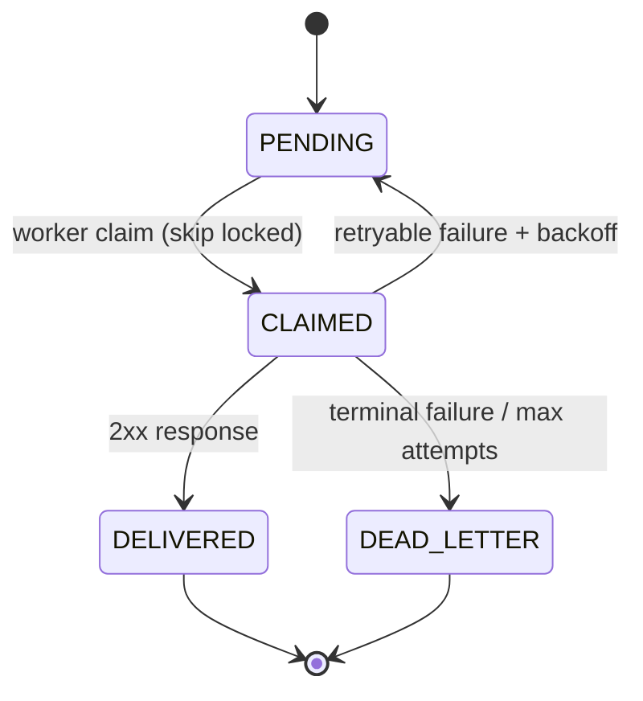

# Phase C.3 Delivery Lifecycle Diagram

```mermaid
stateDiagram-v2
  [*] --> PENDING
  PENDING --> CLAIMED: worker claim (skip locked)
  CLAIMED --> DELIVERED: 2xx response
  CLAIMED --> PENDING: retryable failure + backoff
  CLAIMED --> DEAD_LETTER: terminal failure / max attempts
  DELIVERED --> [*]
  DEAD_LETTER --> [*]
```

