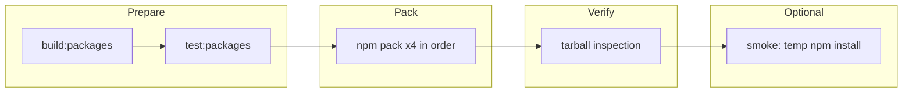

# Phase E.1a.2 — Execution guide (local dry-run kit)

**Goal:** One repeatable path to prove SDK packages are **packable, inspectable, and installable from tarballs** before any CI publish automation (E.1a.3+).

---

## Quick path

From the monorepo root:

```powershell
npm ci
npm run release:dry-run
```

For the full path including **temporary npm install** and ESM/CJS import checks:

```powershell
npm run release:dry-run:full
```

**CI parity (E.1a.3):** run the same gates as GitHub Actions locally:

```powershell
npm run ci:verify-sdk
```

---

## What runs (high level)



- **release:dry-run:** `B` → `T` → `P` → `V`
- **release:dry-run:full:** same, then `S` (reuses packs, no second pack)

---

## Where to read more

| Topic | Document |
|--------|-----------|
| Command reference, tarball rules, smoke details | [Local release runbook](phase-e1a2-local-release-runbook.md) |
| Freeze criteria | [E.1a.2 validation checklist](phase-e1a2-validation-checklist.md) |
| Version tags and publish order (registry, later) | [E.1a.1 release policy](phase-e1a1-release-policy.md) |

---

## Implementation map

| Area | Location |
|------|-----------|
| Pack order + `npm pack` | `scripts/sdk-release/pack-workspaces.ts` |
| Tarball checks | `scripts/sdk-release/verify-tarball.ts` |
| Install smoke | `scripts/sdk-release/install-smoke.ts` |
| CLI | `scripts/sdk-release/cli.ts` |
| Constants (paths, limits, workspace list) | `scripts/sdk-release/config.ts` |

---

## Non-goals (E.1a.2)

- No `npm publish` or registry dry-run.
- No GitHub Actions.
- No change to `@sammati/*` public APIs or platform backend.
