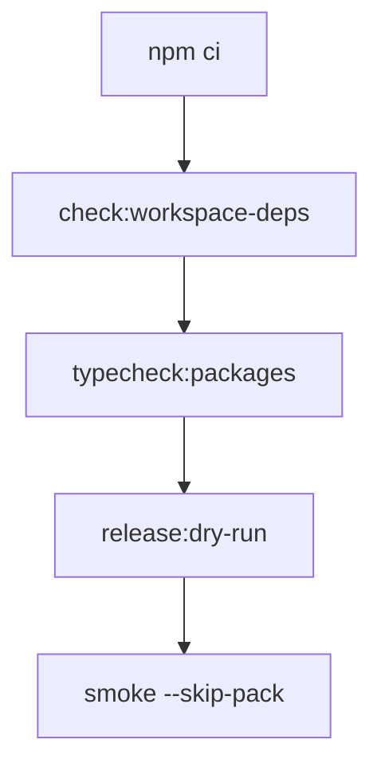

# Phase E.1a.3 — CI verify-only workflow (GitHub Actions)

**Goal:** Run the same **SDK verification** gates as E.1a.2 on every push/PR to `main` / `master`, with **no npm publish**, **no `NPM_TOKEN`**, and **no registry writes** (except `npm install` during tarball smoke into a CI temp directory, same as local).

**Workflow file:** [`.github/workflows/sdk-verify.yml`](../.github/workflows/sdk-verify.yml)

---

## What runs (deterministic order)

| Step | Command | Blocks merge when |
|------|---------|-------------------|
| 1 | `npm ci` | Lockfile out of sync, install failure |
| 2 | `npm run check:workspace-deps` | Workspace `package.json` dependency drift (non–`file:../shared-core` or extra deps) |
| 3 | `npm run typecheck:packages` | `tsc --noEmit` fails in any SDK package |
| 4 | `npm run release:dry-run` | Build, vitest, `npm pack`, or tarball verification fails |
| 5 | `npx tsx scripts/sdk-release/cli.ts smoke --skip-pack` | Tarball install or ESM/CJS import smoke fails |

Steps 4–5 together match **`npm run release:dry-run:full`**, split into two CI steps for clearer logs (no duplicate `release:dry-run`).

---

## Runtime matrix

| Setting | Value |
|---------|--------|
| Runner | `ubuntu-latest` |
| **Node** | `20.x`, `22.x` (minimal dual-LTS; `fail-fast: true`) |
| Cache | npm via `actions/setup-node` `cache: npm` |
| Timeout | 20 minutes |

---

## Fail-fast and blocking behavior

- **Job-level** `strategy.fail-fast: true`: first failing Node version cancels the other matrix leg (optional: set `fail-fast: false` if you need both versions’ logs every time).
- **Step order:** typecheck runs before `release:dry-run` so pure type errors fail without a full pack cycle.
- **Merge policy:** Treat this workflow as a **required check** in GitHub branch protection when you enable it.

---

## Artifact verification (in CI)

Covered inside `release:dry-run` and `smoke` (same as [E.1a.2 runbook](phase-e1a2-local-release-runbook.md)):

- Packed tarballs under `.release/packs/`
- `exports` / typings / required `dist` files
- Forbidden paths and tarball size cap
- ESM + CJS import smoke after `npm install` from tarballs (`overrides` for `@sammati/shared-core`)

---

## Security posture (E.1a.3)

- **No** `secrets:` usage.
- **No** `npm publish` or `NPM_TOKEN`.
- **No** OIDC publish provenance (deferred to E.1a.4+).

---

## Out of scope for this workflow

- **Ledger app** TypeScript build (`npm run build` at repo root) and server tests are **not** run here; this job targets `@sammati/*` SDK packages only. Add a separate workflow later if you need full monorepo gates on every PR.

**Registry publish:** Handled only by [E.1a.4 SDK publish](phase-e1a4-publish-workflow.md) (`sdk-publish` workflow), not by `SDK verify`.

---

## Local vs CI

| Aspect | Local | CI |
|--------|--------|-----|
| Install | `npm ci` recommended | `npm ci` only |
| Parity command | `npm run ci:verify-sdk` | Same steps as workflow |
| OS | Windows/macOS/Linux | Ubuntu only |
| `tar` | Required for verify/smoke | Present on `ubuntu-latest` |
| npm | ≥ 8.3 recommended for smoke (`overrides`) | Node 20/22 ship compatible npm |

---

## Troubleshooting

| Symptom | Likely cause |
|---------|----------------|
| `npm ci` fails | `package-lock.json` not committed or out of date — run `npm install` locally and commit lockfile |
| `check:workspace-deps` fails | A workspace package gained a new dependency or changed `file:../shared-core` — intentional publish-prep only |
| Typecheck passes locally, fails in CI | Different Node version — align local Node with matrix or run `nvm use 20` / `22` |
| Smoke fails only in CI | Network/registry flake during `npm install` in temp project — re-run job; check npm audit/fund flags (we use `--no-fund --no-audit`) |
| `tar` errors | Rare on Ubuntu; if using a custom runner, ensure GNU tar available |

---

## Related

- [E.1a.2 local release runbook](phase-e1a2-local-release-runbook.md)
- [E.1a.3 validation checklist](phase-e1a3-validation-checklist.md)
- [E.1a.1 release policy](phase-e1a1-release-policy.md)
