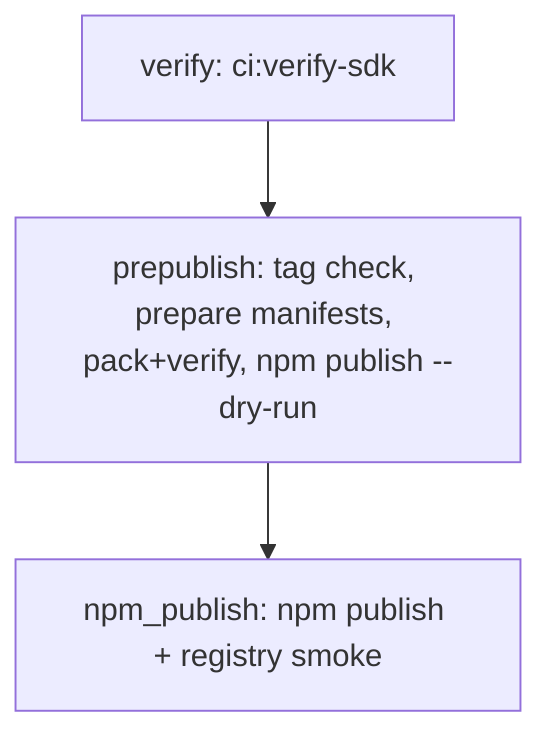

# Phase E.1a.4 — Gated npm publish workflow

**Goal:** Publish `@sammati/*` packages to the public npm registry in a **fixed order**, only from **release tags** or a **controlled manual dispatch**, with **secrets isolated** to the publish job and **verification before any upload**.

**Workflow:** [`.github/workflows/sdk-publish.yml`](../.github/workflows/sdk-publish.yml)  
**Related:** [E.1a.1 release policy](phase-e1a1-release-policy.md), [E.1a.1 governance](phase-e1a1-release-governance.md), [E.1a.2 runbook](phase-e1a2-local-release-runbook.md), [E.1a.3 CI verify](phase-e1a3-ci-verify.md).

**Operations (pre-first-publish):** [Publish pipeline **dry-run** checklist](phase-e1a4-publish-pipeline-dry-run-checklist.md) · [**First real publish — execution and validation**](phase-e1a4-first-real-publish-execution-guide.md) · [Pre-release readiness](phase-e1a4-pre-release-first-publish-readiness.md) · [Operator runbook](phase-e1a4-operator-runbook.md) · [First publish checklist](phase-e1a4-first-publish-checklist.md) · [Troubleshooting](phase-e1a4-release-troubleshooting.md) · [Post-publish verification](phase-e1a4-post-publish-verification.md)

---

## Triggers (no accidental publish on normal pushes)

| Trigger | Behavior |
|---------|-----------|
| `push` of tag `sdk-v*` | Full pipeline: verify → prepublish → **npm publish** → post-publish smoke |
| `workflow_dispatch` | **Default `dry_run_only: true`:** verify + prepublish + `npm publish --dry-run` only. Set `dry_run_only` to **false** to run the `npm_publish` job (still requires GitHub Environment approval if configured). |

Ordinary commits to `main` / PRs **do not** run this workflow.

---

## Job graph



- **`verify`:** Same gates as [SDK verify](phase-e1a3-ci-verify.md) (`npm run ci:verify-sdk`) on the **tagged commit**, using workspace `file:` dependencies (unchanged tree).
- **`prepublish`:** No secrets. Rewrites `package.json` for registry (see below), reconciles `npm install`, builds, packs, verifies tarballs, runs **`npm publish --dry-run`** for each package in order.
- **`npm_publish`:** Runs only on tag push, or on manual dispatch with `dry_run_only == false`. Uses GitHub Environment **`npm`** and **`secrets.NPM_TOKEN`**. Performs real **`npm publish`**, then installs from the **public registry** and runs ESM/CJS smoke.

---

## Publish order (enforced)

Sequential, one package at a time (no parallel races):

1. `@sammati/shared-core`
2. `@sammati/webhook-utils`
3. `@sammati/server-sdk`
4. `@sammati/widget-sdk`

Implemented in [`scripts/sdk-release/publish-registry-sequential.ts`](../scripts/sdk-release/publish-registry-sequential.ts) (8s pause between real publishes for registry propagation).

---

## Registry manifest preparation

[`scripts/sdk-release/prepare-registry-manifests.ts`](../scripts/sdk-release/prepare-registry-manifests.ts) (CI only, ephemeral checkout):

- Removes `private` from all four SDK `package.json` files.
- Sets dependents’ `@sammati/shared-core` to `^<version>` read from `shared-core/package.json`.

Then **`npm install`** at the repo root reconciles the lockfile/workspace graph before build/publish.

---

## Tag ↔ version contract

[`scripts/sdk-release/verify-release-tag-versions.ts`](../scripts/sdk-release/verify-release-tag-versions.ts) requires:

- Tag name `sdk-v<version>` (e.g. `sdk-v0.2.0`).
- **Every** `@sammati/*` `package.json` **`version`** equals `<version>`.

Local check (set tag you intend to push):

```powershell
$env:RELEASE_TAG='sdk-v0.2.0'
npm run release:verify-tag
```

---

## Protected release controls (GitHub)

1. **Environment `npm`**
   - Create in: Repo → Settings → Environments → **npm**.
   - Add **required reviewers** for production releases.
   - Add secret **`NPM_TOKEN`** (or organization-level secret scoped to this environment).

2. **Token assumptions (minimal scope)**
   - **Granular access token** (recommended) or automation token with **publish** permission for packages under scope **`@sammati`** only.
   - Enable **2FA** on the npm account; use tokens suitable for CI (not a password).

3. **Secrets usage**
   - **`NPM_TOKEN` appears only** in the **`npm_publish`** job (`.npmrc` write + publish step).
   - **`verify`** and **`prepublish`** do not reference `secrets`.

---

## Post-publish validation

[`scripts/sdk-release/post-publish-registry-smoke.ts`](../scripts/sdk-release/post-publish-registry-smoke.ts):

- Polls `npm view @sammati/<pkg>@<version>` until each package is visible (up to ~135s per package with backoff).
- Clean temp project: `npm install` all four at **exact** `<version>`.
- Runs the same **ESM + CJS** import checks as local tarball smoke, against **registry** tarballs.
- Runs `npm ls` per package for resolution sanity.

---

## Release execution runbook (maintainer)

1. Bump **all four** SDK `version` fields to the same SemVer; commit to `main` (or release branch per policy).
2. Annotated tag: `git tag -a sdk-vX.Y.Z -m "SDK X.Y.Z"` at that commit; `git push origin sdk-vX.Y.Z`.
3. **SDK publish** workflow runs:
   - Confirm **`verify`** and **`prepublish`** succeed (inspect `npm publish --dry-run` logs).
   - Approve **`npm_publish`** if the environment requires it.
4. Confirm **`post-publish`** registry smoke succeeds.
5. If anything fails after partial publish, follow [rollback / deprecate](phase-e1a1-release-governance.md#rollback-and-deprecation-npm) (new patch version; `npm deprecate` as needed).

**Manual dry-run (no tag push):** Actions → **SDK publish** → Run workflow → set **tag** to an existing `sdk-v*` tag → leave **dry_run_only** true (default).

**Manual publish from UI (rare):** Same, set **dry_run_only** to false (requires token + approval). Prefer **tag push** for auditability.

---

## Local vs CI

| Step | Local | CI publish workflow |
|------|--------|----------------------|
| Workspace verify | `npm run ci:verify-sdk` | `verify` job |
| Tag vs versions | `npm run release:verify-tag` | prepublish + npm_publish |
| Registry manifests | `npm run release:prepare-registry` (mutates `package.json`; **`git restore` after** if experimenting) | prepublish / npm_publish (ephemeral checkout) |
| Dry-run publish | `DRY_RUN=1 npx tsx scripts/sdk-release/publish-registry-sequential.ts` | prepublish |
| Real publish | manual `npm publish` (not recommended) | `npm_publish` job only |

---

## Troubleshooting

| Issue | What to check |
|--------|----------------|
| `verify` fails | Fix `ci:verify-sdk` locally on the **same commit** as the tag. |
| Tag / version mismatch | Tag must be `sdk-v` + exact `version` in all four `package.json` files. |
| `prepublish` dry-run fails | Scoped package / permissions: some npm versions may still need read-only token for dry-run; document token in environment **read** if required. |
| `npm_publish` 403 | Token lacks publish rights for `@sammati`; OTP/password-only account. |
| Post-publish smoke timeout | npm replication delay; re-run job or increase wait in script (rare). |
| `npm ERR! need auth` on publish | `NPM_TOKEN` missing from environment `npm` or wrong registry host. |

---

## Rollback / deprecate

See [E.1a.1 governance — rollback and deprecation](phase-e1a1-release-governance.md#rollback-and-deprecation-npm). npm does not support unpublishing past the short window except policy exceptions; **patch forward** and **`npm deprecate`** are the normal tools.

---

## Post-publish verification checklist (human)

After a successful **`npm_publish`** run:

- [ ] Workflow logs show four successful **`npm publish`** steps in order.
- [ ] **`Post-publish install + ESM/CJS smoke`** step exited 0.
- [ ] On a clean machine (or StackBlitz/REPL), `npm install @sammati/shared-core@X.Y.Z` resolves and imports work.
- [ ] Release notes / changelog updated (per [E.1a.1 governance](phase-e1a1-release-governance.md)).
- [ ] If anything is wrong with a version, plan **`npm deprecate`** and a **patch** release (see governance).

---

## Non-goals (E.1a.4)

- Application (`sammati-ledger`) deploy, Kubernetes, or non-npm infrastructure.
- npm **provenance** / OIDC (optional hardening later).
- Changing SDK public APIs or backend contracts.
